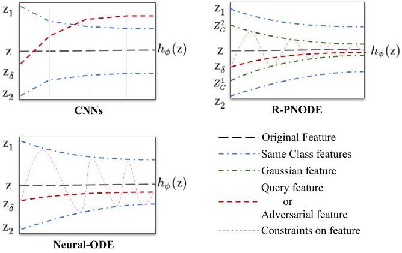

# RPNODE_FSS
Robust Prototypical Few-Shot Organ Segmentation with Regularized Neural-ODEs


<p align="center">
  <br>
</p>

## Installation and setup

To install this repository and its dependent packages, run the following.

```
git clone https://github.com/rpnode-fss/RPNODE_FSS.git
cd RPNODE_FSS
conda create --name RPNODE_FSS # (optional, for making a conda environment)
pip install -r requirements.txt
```

The processed datasets can be downloaded from [here](https://drive.google.com/drive/folders/1o2yiBOKzkwxsSc-gWWwE_Z0yJiWtenMa?usp=sharing).

Some relevant trained model weights can be downloaded from [here](https://drive.google.com/drive/folders/1oUdQ-mDndbCiiWQSdMX_ihhzPYWMGK8A?usp=sharing).

Change the paths to BCV, CT-ORG and Decathlon datasets in  [`config.py`](./config.py) and  [`test_config.py`](./test_config.py) according to paths on your local. Also change the path to ImageNet pretrained VGG model weights in these files.


## Training

To train  R-PNODE,  run

```
python3 train.py with dataset=BCV model_name=<save-name> target=<train-target> n_shot=<shot> ode_layers=3 ode_time=4
```

Further parameters like the standard deviation of gaussian perturbation can be changed in the training [`config`](./config.py). 

So, for example, to train the experiment BCV 1-shot with Spleen organ as the novel class, the command would be 

```
python3 train.py with dataset=BCV model_name=bcv_1shot_spleen target=1 n_shot=1 ode_layers=3 ode_time=4
```
This will store model weights with the name bcv_1shot_spleen_tar1.pth in the model root directory. Please refer to the class mapping below to find which target index to use for which target class. Note that a single model is needed to test the method in both in-domain and cross-domain settings for a particular shot and target. Similarly, all different attacks are tested on a single trained model.

## Testing

To test a trained model, run

```
python3 test_attacked.py with snapshot=<weights-path> target=<test-target> dataset=<BCV/CTORG/Decathlon> attack=<Clean/FGSM/PGD/SMIA> attack_eps=<eps> to_attack=<q/s>
```

The possible options for the `attack` argument are: 

- [x] clean (standard FSS, without any attack)
- [x] fgsm
- [x] pgd
- [x] smia
- [x] bim 
- [x] cw
- [ ] dag
- [ ] auto

These are case insensitive, and using variants like FGSM, FGsm, fGsM will also lead to same effect. 

This command can be used for testing on all settings, namely 1-shot and 3-shot, liver  and  spleen and Clean, FGSM, PGD, SMIA, BIM, CW, DAG and Auto-Attack with different epsilons. 

### Visualization

Visualization can be enabled by setting `save_vis` as True. The path where the visualisations will be saved can be modified [here](https://github.com/rpnode-fss/RPNODE_FSS/blob/105f5eae0638f20c2d1fc118f673c332376e028c/test_attacked.py#L343).

## Acknowledgement

This repository adapts from [`BiGRU-FSS`](https://github.com/oopil/3D_medical_image_FSS). 4 of the baselines are from here. The other baseline is the Neural-ODE based [`SONet`](https://github.com/yao-lab/SONet). Attacks are adapted from well known libraries like [`CleverHans`](https://github.com/cleverhans-lab/cleverhans) and [`TorchAttacks`](https://github.com/Harry24k/adversarial-attacks-pytorch). Other attacks are adapted from their respective sources: [`SMIA`](https://github.com/imogenqi/SMA), [`DAG`](https://github.com/IFL-CAMP/dense_adversarial_generation_pytorch) and [`Auto-attack`](https://github.com/BCV-Uniandes/ROG). We thank the authors for their awseome works.


### Class Mapping

```
BCV:
    Liver: 6
    Spleen: 1
CT-ORG: 
    Liver: 1
Decathlon: 
    Liver: 2
    Spleen: 6
```
