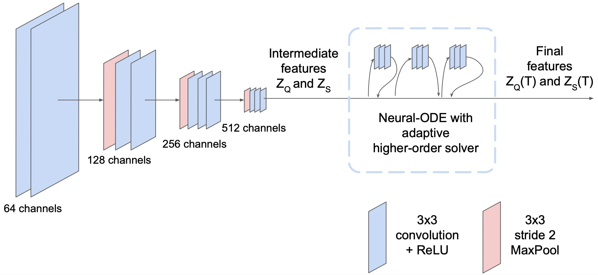

# RPNODE_FSS
Improving Adversarial Robustness for Few Shot Segmentation with Regularized Neural-ODEs


<p align="center">
  
  <br>
  Overview of the architecture of R-PNODE and the basic intuition of regularisation
</p>

## Installation and setup

To install this repository and its dependent packages, run the following.

```
git clone https://github.com/rpnode-fss/RPNODE_FSS.git
cd RPNODE_FSS
conda create --name RPNODE_FSS # (optional, for making a conda environment)
pip install -r requirements.txt
```

Change the paths to BCV, CT-ORG and Decathlon datasets in  `config.py` and  `test_config.py` according to paths on your local. Also change the path to ImageNet pretrained VGG model weights in these files.


## Training

To train baseline methods, go to their respective folders and run

```
python3 train.py with model_name=<save-name> target=<test-target> n_shot=<shot>
```


For  AT-PANet, run `train_adversarial.py` from PANet folder with the same  arguments as before.


For  PNODE, some extra arguments are needed. To train  PNODE,  run

```
python3 train.py with model_name=<save-name> target=<test-target> n_shot=<shot> ode_layers=3 ode_time=4
```

Further parameters like the standard deviation of gaussian perturbation can be changed in the configs. 

## Testing

To train baseline methods, go to their respective folders and run

```
python3 test_attacked.py with snapshot=<weights-path> target=<test-target> dataset=<BCV/CTORG/Decathlon> attack=<Clean/FGSM/PGD/SMIA> attack_eps=<eps> to_attack=<q/s>
```

This command can be used for testing all  models on all settings, namely 1-shot and 3-shot, liver  and  spleen and Clean, FGSM, PGD and SMIA with different epsilons. 


### Class Mapping

```
BCV:
    Liver: 6
    Spleen: 1
CT-ORG: 
    Liver: 1
Decathlon: 
    Liver: 2
    Spleen: 6
```
